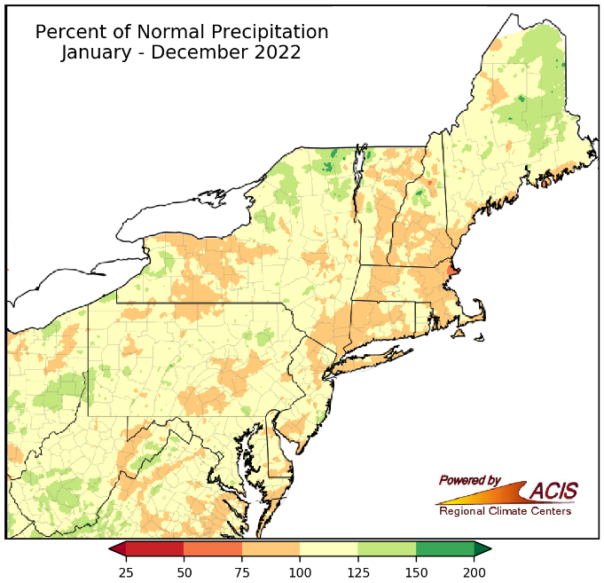
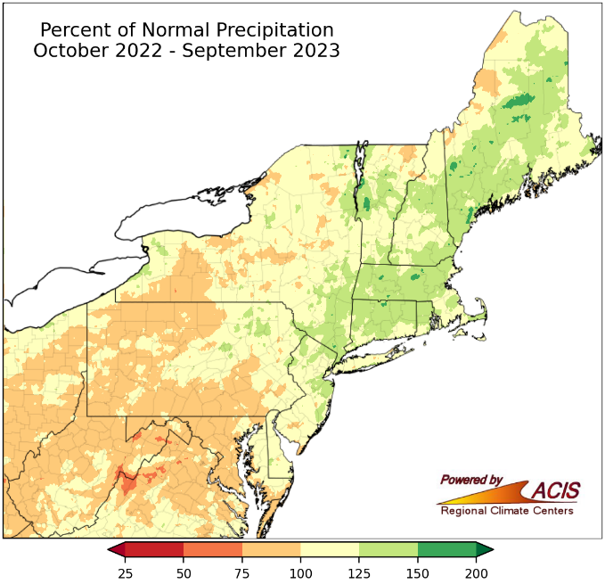
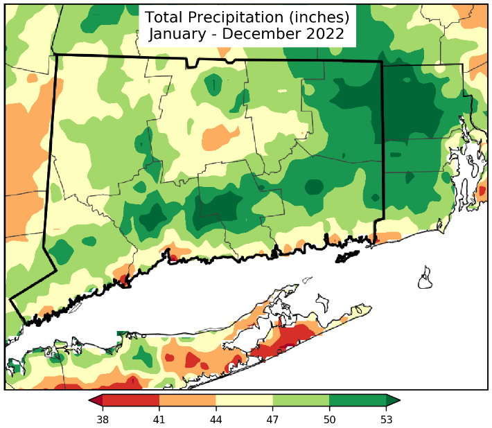
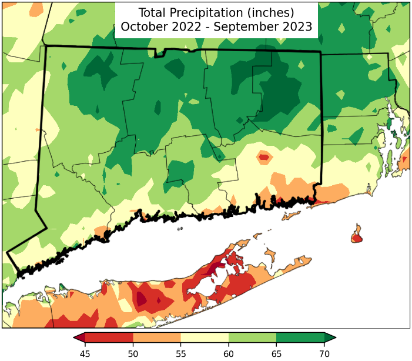
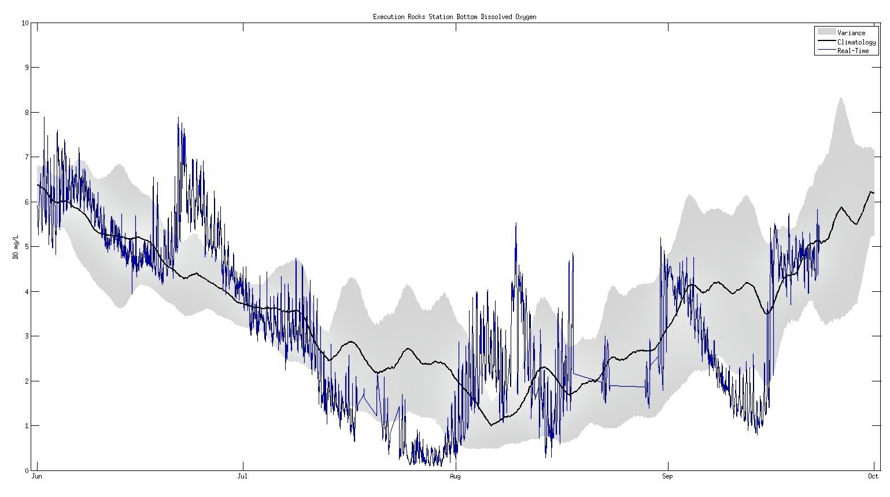
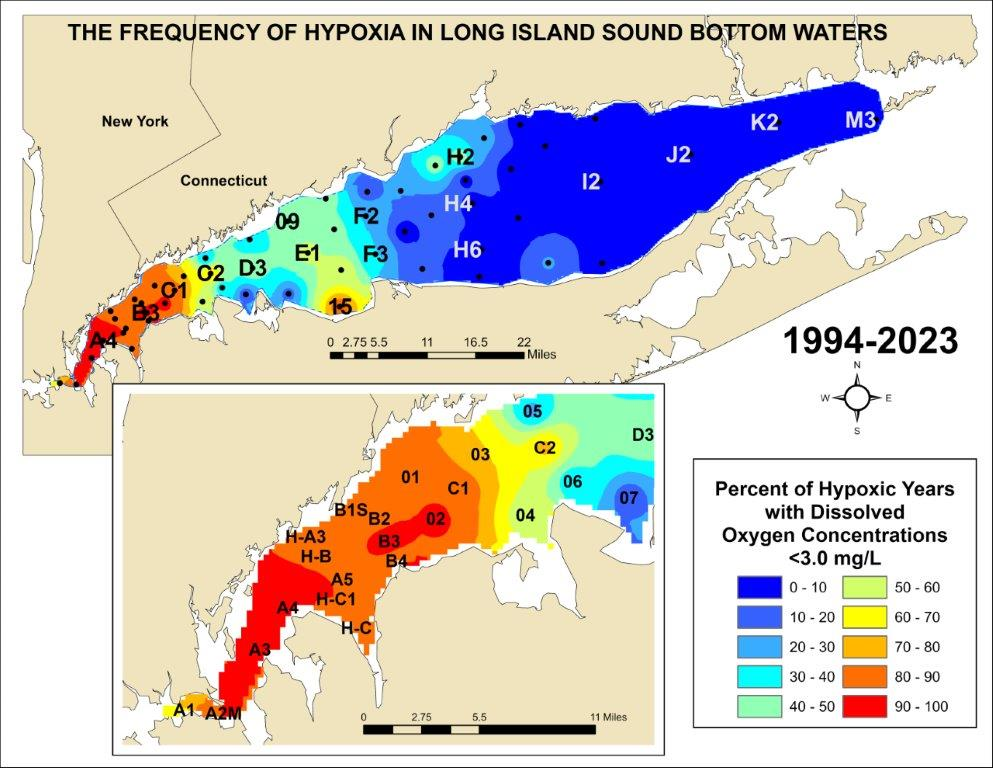

```{r setup, include=FALSE}
##install.packages("rmdformats")
library(rmdformats)
knitr::opts_chunk$set(echo = FALSE, warning = FALSE, message = FALSE)
```
```{r, echo=FALSE, out.width="150%"}
   

options(repos = list(CRAN = "http://cran/rstudio.com/"))

```


 
<hr>
## **Background** 
<hr>
Hypoxia is a condition in which of low or depleted dissolved oxygen concentrations are observed in the waters of Long Island Sound (LIS).  Hypoxia impacts up to half of the LIS waters each summer. The primary cause of hypoxia is excess nitrogen from human sources. These sources include sewage treatment plant discharges, storm water runoff and atmospheric deposition.

Dissolved oxygen (DO) levels below 3.0 mg/L are considered hypoxic in LIS.  Hypoxic conditions causes impairment and in some cases, death to aquatic life. Some studies have found DO can become limiting below 4.8 mg/L for sensitive fish species, while more tolerant species are not affected until DO falls below 2.0 mg/L (Simpson et al 1995,1996).  

Since 1991, the [Connecticut Department of Energy and Environmental Protection (CT DEEP)](https://portal.ct.gov/DEEP/Water/LIS-Monitoring/LIS-Water-Quality-and-Hypoxia-Monitoring-Program-Overview) and the [Interstate Environmental Commission (IEC)](https://www.iec-nynjct.org/programs/water/sound-monitoring) have conducted an intensive water quality monitoring program on LIS. The program is funded through a grant from the U.S. Environmental Protection Agency's (EPA) [Long Island Sound Study](https://longislandsoundstudy.net/). Data from the surveys are used to quantify and identify annual trends and differences in water quality parameters relevant to hypoxia, in particular nutrients, temperature, and chlorophyll. These data are also used to evaluate the effectiveness of the LIS management programs efforts to reduce anthropogenic nitrogen inputs, since nitrogen is a primary contributor to the excessive algae growth that leads to hypoxia in LIS. 

During the summer (June - September), surveys across LIS (Figure 1) are conducted at bi-weekly intervals to better define the areal extent and duration of hypoxia. During these surveys stations are sampled for in-situ parameters including dissolved oxygen, temperature, pH, and salinity. 

```{r, fig.cap = '<i> Interactive map of LIS survey stations.  Click on each station to find information on sampling index period for that station. </i>'}
##install.packages("sf")
##install.packages ("geojsonio")
##install.packages ("htmltools")
##install.packages("htmlwidgets")
##install.packages("stringi")
##install.packages(c("sp", "raster"))

library(leaflet)
library(readxl)


RefPts <- read_excel("data/ReferencePoints2.xlsx")

RefPts$color <- ifelse(RefPts$StationType == "CTDEEP", "blue", 
                ifelse(RefPts$StationType == "UCONN", "yellow", "salmon"))
  
  
mRefPts <-leaflet() %>% 
  addProviderTiles(providers$CartoDB.PositronNoLabels) %>% 
  setView(lng = -72.799, lat = 41.126, zoom = 9) %>%   
  addCircleMarkers(data=RefPts,  
                  lng= ~Longitude,
                  lat= ~Latitude, 
                  radius = 2,
                  color = ~color, 
                  popup=~paste(RefPts$StationType, "<br> Station_Name:", RefPts$Station_Name,
                            "<br>Depth:", RefPts$Approximate_Depth,
                            "<br>Schedule:", RefPts$Schedule,
                            "<br>Sampling Dates:", RefPts$`Sampling Dates`,
                            "<br>Parameters:", RefPts$Parameters), 
                  label = ~as.character(RefPts$Station_Name, RefPts$Approximate_Depth))%>%


  ##addLayersControl(overlayGroups = c('CTDEEP', 'UCONN', 'IEC'),           ##options=layersControlOptions(collapsed=FALSE),
 ##         position = 'bottomleft')%>%
  
  addLegend("bottomright",
            opacity = 1.0, 
            colors= c("blue", "yellow", "salmon"),
            labels= c("CTDEEP", "UCONN", "IEC"),
  title= "Long Island Sound <br> Monitoring Stations")

                  
mRefPts

```

</br>

During the summer of 2023, CT DEEP conducted seven surveys across LIS between May 31 and September 7.  IEC conducted twelve surveys in western LIS between June 28 and September 12. Hypoxic conditions were documented during three CT DEEP surveys and nine IEC surveys.  

<!-- Data from all CTDEEP cruises can be downloaded from the [UCONN -->
<!-- ERDDAP](http://merlin.dms.uconn.edu:8080/erddap/tabledap/DEEP_WQ.html). All -->
<!-- samples are collected and analyzed under EPA-approved Quality Assurance Project -->
<!-- Plans. -->

<div class = 'itable'>
```{r, tab.cap = '<i> Summary of sampling events during the 2023 Hypoxia Season</i>'}

install.packages("kbleExtra")

library (readxl)
library (kableExtra)


dt <- read_excel("data/CruiseInfoTable2023.xlsx")

dt %>%
  kbl(caption =  "2023 Long Island Sound Hypoxia Season Cruise Information", align = "c", col.names = c("Cruise", "Start Date", "End Date", "Number of Stations Sampled", "Number of Hypoxic Stations", "Hypoxic Area (mi2)", "Minimum DO", "Station Where Minimum DO Occurred")) %>%
  kable_classic(full_width = F, html_font = "Cambria") %>%
  scroll_box(height="300px") 
  
```
</div>

<hr>
## **Weather Summary**
<hr>
Leading up to 2023’s hypoxia survey season, Connecticut experienced its warmest winter on record, with temperatures 2ºF to 8ºF above normal in February. Much of the Northeast ranked within the warmest 20 for maximum temperature averages during the Spring season (Mar-May). Above average precipitation in June caused major flooding across the Northeast and increased the flow of debris and runoff into the region’s rivers. June also had a drop in temperatures and air quality, with winds funneling smoke from Quebec wildfires into the region.  

In July the Northeast experienced both record heat and rainfall. Precipitation fell at 200% to 300% of normal, making it the fourth wettest July on record for the Northeast. In August, temperatures dipped with 29 out of the 35 major climate sites recorded as cooler than normal. The Northeast Regional Climate Center (NRCC) also observed 130 percent of normal precipitation within the region.  

During August, there were 30 confirmed tornadoes in the Northeast, reaching seven times the region’s August average of four tornadoes (based on 1998-2022 data). September ranked among the 20 warmest Septembers on record for 10 states and ranked among the 20 wettest on record for five states. September’s precipitation was 215% of normal in Connecticut. Two tropical systems affected the Northeast in September. Hurricane Lee produced rough surf and rip currents along the East Coast from around September 13 to 16 and Tropical Storm Ophelia resulted in multiple days of higher-than-usual water levels and contributed to major flash flooding in New York City on the 29th.   

<!-- You have different time periods than the sampling period for maps so I would suggest removing. -->


<!-- ```{r, echo=FALSE, out.width="90%", fig.align = 'center''} -->

<!--  -->


<!-- ``` -->

<!-- ```{r, echo=FALSE, out.width="90%", fig.align = 'center'} -->

<!--  -->


<!-- ``` -->


<!-- ```{r, echo=FALSE, out.width="90%", fig.align = 'center'} -->

<!--  -->

<!-- ``` -->


<!-- ```{r, echo=FALSE, out.width="90%", fig.align = 'center'} -->

<!--  -->


<!-- ``` -->


During 2022, the Northeast saw 45.40 inches of precipitation, which was 100 percent of normal. So far, 2023 shows increased departures from normal precipitation in the Northeastern states.  

<!-- ### November is outside the hypoxic sampling period so I would remove or create a graph using data during the sampling period ####-->

<!-- ```{r'} -->
<!-- library(ggplot2) -->
<!-- library (readxl) -->
<!-- library (plotly) -->

<!-- ##Precipgr  <- read_excel("data/Precipitation graphs.xlsx") -->

<!-- survey <- data.frame(group=rep(c("Year-to-Date_Precipitation", "Normal- YTD_Precipitation"),each=8), -->
<!--                      County=rep(c("Fairfield", "Hartford", "Litchfield", "Middlesex", "NewHaven",    -->
<!--                                  "NewLondon", "Tolland", "Windham"),2), -->
<!--                      Precipitation=c(46.69, 52.71, 50.9, 45.99, 45.56, 39.19, 52.04, 50.43, 40.99, 41.22, 41.22, 41.41, 41.41, 39.64, 39.63, 39.65)) -->

<!-- ggplot(survey, aes(x=County, y=Precipitation, fill=group)) +  -->
<!--   geom_col(stat="identity", width= 0.7, position=position_dodge(width=0.8))+ -->
<!-- labs(title =("Connecticut Precipitation (November 2023)"),  -->
<!--         y= "Precipitation (in)",  -->
<!--         x= "County") + -->
<!--       theme(legend.position = "bottom",  -->
<!--         axis.text.x = element_text(angle = -45),  -->
<!--         legend.title=element_blank(), -->
<!--         legend.text =element_text(size=10))+ -->
<!--   scale_fill_manual(values= c("maroon", "orange")) -->

<!-- ``` -->

```{r, fig.cap = '<i>Monthly rankings for precipitation in Connecticut in 2022 and 2023. Rankings are by NRCC for the 129 years between 1895 and 2023. 1 = driest; 129 = wettest. Data and summary adapted from https://www.nrcc.cornell.edu/ </i>'}

library(ggplot2)
library (readxl)
library (plotly)
library (forcats)

Precip_rank <- data.frame(group=rep(c("2023 Precipitation Rank", "2022 Precipitation Rank"),each=9),
  month=c("Jan", "Feb", "Mar", "Apr", "May", "Jun", "Jul", "Aug", "Sep"),
                 Rank_Nth_driest=c(117, 7, 62, 89, 40, 35, 128, 86, 126, 35, 101, 30, 88, 31, 67,
                                   11, 34, 108))

Precip_rank %>%
  mutate(month = fct_relevel(month, 
            "Sep", "Aug", "Jul", "Jun", "May", "Apr","Mar", "Feb", "Jan")) %>%
ggplot(aes(x=month, y=Rank_Nth_driest, fill=group)) + 
  geom_bar(stat="identity", width= 0.7, position=position_dodge(width=0.8))+
labs(title =("2022 & 2023 Monthly Precipitation Rankings in Connecticut"), 
        y= "Rank Nth Driest on Record", 
        x= "Month") +
            theme(legend.position = "bottom", 
            legend.title=element_blank(),
        legend.text =element_text(size=10))+
  scale_fill_manual(values= c("blue", "red"))+ 
  scale_y_continuous(breaks= seq(0, 140, by=10), expand = c(0,2))+
coord_flip() 

```

<!-- *Rankings are by NRCC for the 129 years between 1895 and 2023. 1=driest; 129=wettest* -->
<!-- <br> -->
<!-- *Data and summary adapted from https://www.nrcc.cornell.edu/* -->
<!-- <br> -->
<!-- <br> -->
<!-- More Info: [NERFC Precipitation Totals and Departures from Normal](https://www.weather.gov/nerfc/watersupply)<br> -->
<!-- [NRCC Summary Tables](https://www.nrcc.cornell.edu/regional/tables/tables.html) <br> -->
<!-- [EPSTAR Drought and Water Resources Guidance](w1.weather.gov/data/TAR/ESPTAR) -->

<hr>
## **Maximum Hypoxic Area**
<hr>

CT DEEP utilizes Geographic Information System (GIS) software to create interpolations of bottom water dissolved oxygen concentrations across LIS and estimate the area effected by hypoxia on a cruise by cruise basis. Changes in the maximum hypoxic area over the LISS sampling period of record can be see in this [**video**](https://youtu.be/cl7MmCm8Kao?list=PLN8TZ_MzsZN_RhkPBddClSNZz74MDdr2b).

**In 2023, the maximum area of Long Island Sound with bottom water dissolved oxygen (DO) concentrations below 3.0 mg/L was 126.8 sq. mi (328.4 sq. km) and occurred during the WQAUG23 survey conducted 31 July - 3 August 2023**(Figure 3). During this survey four stations had DO concentrations below 2 mg/L, eight stations had concentrations below 3.0 mg/L, and 10 stations had concentrations between 3 and 3.5 mg/L. The lowest dissolved oxygen concentration recorded during the survey was 1.69 mg/L at Station A4.


```{r, echo=FALSE, out.width="90%", fig.align = 'center', fig.cap = '<i> LIS Dissolved Oxygen concentrations recorded during August 2023 survey</i>'}

knitr::include_graphics("images/WQAUG23_DO_MAP.jpg")


```
<br>

The LISS utilizes a five-year rolling average to determine progress towards meeting the management target of reducing the area of LIS bottom water exhibiting hypoxic conditions. The five-year rolling average is used to assess trends because conditions in any given year could be impacted by variable factors, such as extreme weather conditions.  The years  1987-1999  are used as a baseline because they represent the beginning of LISS's water quality monitoring program prior to the LIS Total Maximum Daily Load (TMDL) developed in 2000 targeting a reduction in nitrogen loads to LIS. Read more about the [hypoxia extent ecosystem target](https://longislandsoundstudy.net/ecosystem-target-indicators/lis-hypoxia/) established by the LISS.


<div class = 'iplot'>
```{r, fig.cap = '<i>This interactive graph shows the maximum area of hypoxia in square miles (blue bars), duration of hypoxic conditions in days (black circles), and the five-year rolling average area in square miles (green line). Area in square miles, Duration in days </i>'}
##install.packages("png")

library(ggplot2)
library (readxl)
library (png)
library (plotly)

logo <- readPNG("images/logo.png", native=FALSE, info=FALSE)
                
MovAvg  <- read_excel("data/MovingAverage2023.xlsx")

Avg_plot <- ggplot (data=MovAvg)+

  geom_col(aes(x=Year, y=Area), fill="blue")+
  geom_point(aes (x=Year, y=Duration), color= "black")+
  geom_line(aes(x=Year, y=FiveYearAvg),color= "green", size=2)+ 
  labs(title= "Maximum Area and Duration of Hypoxia", subtitle= "1987-2023 (June-September)")+
      theme(title= element_blank())

Avg_plot2<-Avg_plot+ annotation_raster(logo, ymin = 350,ymax= 400,xmin = 2005,xmax = 2025)  
    

ggplotly(Avg_plot2)

```
</div>


<hr>
## **Duration**
<hr>
The duration of hypoxia refers to the estimated length of time that hypoxic conditions persist in the bottom waters of Long Island Sound. Duration is estimated based on dissolved oxygen concentration readings taken at three water quality monitoring stations in the Western Sound - A3, A4, and B3.

**The 2023 hypoxic event lasted an estimated 42 days, beginning on July 12, 2023 and ending on August 22, 2023** (Figure 5). 

The earliest onset of hypoxia (based on CT DEEP data only) occurred on June 25, 2002 and the latest end date was September 20, 2005. The average duration over the 33-year time series is 52 days. The longest hypoxic event was 79 days during 2008. The shortest hypoxic event was 26 days in 2017. 


<div class = 'iplot'>
```{r, fig.cap = '<i>Timing and Duration of Hypoxia in Long Island Sound 1991 - 2023 based on DEEP survey results.</i>'}
library(ggplot2)
library (readxl)
library (plotly)

TimDur  <- read_excel("data/timing and duration.xlsx")

TimDur$TimePer <- factor(TimDur$TimePer, levels = c("After", 
    "During", "Before"))

Dur_plot <- ggplot(data = TimDur) + 
    geom_col(aes( x=Year, y=Day.count, fill= TimDur$TimePer, position= 'stack'))+ 
  ylab('Days')+
  xlab('Year')+
  ggtitle('Timing and Duration of Hypoxia in Long Island Sound')+
    coord_flip()+
  scale_fill_manual(values =c("lightblue", "red", "blue"))+
  theme(plot.title=NULL)+
labs(fill="")+
  scale_y_continuous(breaks=seq(0,360,by=25), expand = c(0,0))+
  scale_x_continuous(breaks=seq(1990,2025,by=5), expand = c(0,0))+
  theme_minimal()+
theme(axis.line = element_line(colour = "black"))+
theme(panel.grid = element_blank())


  
  
  ggplotly(Dur_plot, tooltip = c("Day.count"), fig.align='center')
```
</div>

Table 2 displays the onset, duration, and end of the hypoxic events from 1991 through 2023 based on CT DEEP data only. Using the LISS dissolved oxygen standard of 3.0 mg/L, the average date of onset was July 12 (+9 days), the average end date was September 3 (+11 days), and the average duration was 52 days (+13 days).  

The earliest onset of hypoxia occurred on June 25, 2002, and the latest end date occurred on September 20, 2005.  

The maximum area of hypoxia was 393 square miles and occurred in 1994. The longest hypoxic event occurred in 2008 and lasted 79 days. The shortest hypoxic event occurred in 2017 and lasted 26 days.  

In 2014, 2016, 2017, 2018, and 2020 there were clear periods where the DO concentration rose above the 3.0 mg/L threshold in the early/middle part of August before dipping again during late August and early September. 

<div class = 'itable'>
```{r}

library (readxl)
library (kableExtra)


dt <- read_excel("data/OnsetDuration2023C.xlsx")

dt %>%
  kbl(caption =  "2023 Long Island Sound Onset and Duration of Hypoxia Information", align = "c", col.names = c("Year", "Estimated Start Date", "Estimated End Date", "Maximum Area (mi2)", "Duration (days)")) %>%
  kable_classic(full_width = F, html_font = "Cambria") %>%
  scroll_box(height="300px") 
  
```
</div>

The University of Connecticut Long Island Sound Integrated Coastal Observing System (LISICOS) utilized continuously collected dissolved oxygen data from the Execution Rocks buoy to estimate there were 42.30 days with concentrations below or equal to 3.0 mg/L. There were 28.69 days with DO concentrations less than or equal to 2.0 mg/L and 11.01 days with concentrations below or equal to 1.0 mg/L. The lowest DO concentration recorded by the buoy was 0.08 mg/L on July 8. 


```{r, echo=FALSE, out.width="90%", fig.align = 'center', fig.cap = '<i>Execution Rocks LISICOS Buoy Continuous DO Data June 2023 - October 2023</i>'}




```


<hr>
## **Hypoxic Volume**
<hr>

Hypoxic Volume is a measure of the vertical extent or thickness of hypoxia.  Hypoxic volume is an important measure for aquatic life uses because fish and crustaceans move throughout the water column. 

In 2019, CT DEEP and the O'Donnell lab at the University of Connecticut Marine Sciences Department undertook a project to develop a [*tool*](http://merlin.dms.uconn.edu:9988/webapps/home/) to calculate the hypoxic volume of Long Island Sound. The tool is available to the public and allows users to obtain area and volume estimates on the fly from any survey from 1991-present. The tool utilizes CT DEEP and IEC data.

**The maximum volume of water with concentrations below 3.0 mg/L occurred during the HYAUG23 survey and was 1.2 km3 (0.29 mi3).** Table 3 compares hypoxic area and volume by survey over the 2023 season. 

<div class = 'itable'>
```{r, echo=FALSE, out.width="75%", fig.align = 'left'}

install.packages("kbleExtra")

library (readxl)
library (kableExtra)


dt1 <- read_excel("data/2023_hypoxAreaVol.xlsx")

dt1 %>%
  kbl(caption =  "2023 Volume Estimates of Hypoxic Long Island Sound Bottom Waters Obtained from the UCONN HypVolApp", align = "c", col.names = c("CRUISE", "2 mg/L", "3 mg/L", "4.8 mg/L", "2 mg/L", "3 mg/L", "4.8 mg/L")) %>%
  kable_classic(full_width = F, html_font = "Cambria") %>%
  add_header_above(c(" ", "Area (sq km)" = 3, "Volume (sq km)" = 3))


```
</div>


```{r, echo=FALSE, out.width="90%", fig.align = 'center', fig.cap = "<i>The interactive graph plots the maximum hypoxic volume over time. Initial analyses shows strong evidence that the hypoxic volume in LIS is substantially smaller between 2015 and 2019 than 20 years earlier (O'Donnell, et al., 2020).</i>"}
pacman::p_load(
  rio,       # import/export
  here,      # filepaths
  lubridate, # working with dates
  plotly,    # interactive plots
  scales,    # quick percents
  tidyverse  # data management and visualization
  ) 

library (ggplot2)

library (readxl)


HypoxicVol <- read_excel("data/Hypoxic Volume.xlsx")

Vol_plot <- ggplot (data=HypoxicVol)+
  geom_line(mapping = aes(x=Year, y=Volume)) +
              labs(x= "Year", y= "Volume (km^3)", title= "Volume of Long Island Sound Bottom Waters \nwith Dissolved Oxygen Concentrations Below 3.0 mg/L")

Vol_plot %>% plotly::ggplotly(fig.align='center')


```

<hr>
## **Frequency of Hypoxia**
<hr>
This map illustrates how frequently the areas of Long Island Sound experience hypoxia. The colors represent the percentage of years in which hypoxic conditions have occurred in the bottom waters of Long Island Sound. The westernmost areas have experienced hypoxia almost every year since monitoring began. 

The bar graph provides a deeper dive into the data (percentages) used to create the frequency map. The colors of the bars correspond to the map legend. 

```{r, echo=FALSE, out.width="90%", fig.align = 'center', fig.cap = '<i>The frequency of hypoxia in Long Island Sound Bottom Waters from 1994 - 2023</i>'}



```

<div class = 'iplot'>
```{r, echo=FALSE, out.width="125%", fig.align = 'center', fig.cap = '<i>The percentage of time a station has been hypoxic over the period of survey record </i>'}

install.packages("viridis")
install.packages("RTools")
library (viridis)
library (plotly)
library (ggplot2)
library(readxl)

freq_94_23 <- read_excel("data/freq_94_23.xlsx")

Station_Name <- factor (freq_94_23$STATION_NAME, levels = c("A1", "A2M", "A3", "A4", "H-A3", "H-B", "A5", "H-C1", "H-C", "B1S", "B2", "B3", "B4", "01", "02", "C1", "03", "04", "05", "C2", "06", "07", "08", "D3", "10", "09", "E1", "14", "15", "12", "13", "16", "F2", "F3", "18", "19", "20", "22", "21", "H2", "23", "H4", "H6", "25", "26", "27", "28", "29", "30", "31", "I2", "33", "J2", "K2", "M3"))

percent_plot <- ggplot(data=freq_94_23) + 
  geom_col(aes(x = Station_Name, y = Percentage, width=0.8, fill=Percentage, label1=Percentage, label2=Station_Name)) +
      labs(title =("Percentage of Years Station Has Been Hypoxic (1994-2023)"), 
        y= "Percentage", 
        x= "Station") +
      scale_fill_viridis(option = "H", discrete = FALSE)+
     scale_x_discrete(expand = c(0,0))+
      theme(legend.position = c(0.9,0.7), 
        plot.title = element_text(size = 15), 
        axis.title = element_text(size = 15), 
        strip.background = element_rect(colour="black", fill="white"),
        axis.text.x = element_text(angle = 90), 
        legend.key.size = unit(0.5, 'cm'),
        legend.title=element_text(size=8), 
        legend.text =element_text(size=8))


plotly:: ggplotly(percent_plot, tooltip = c("label1", "label2"))


```
</div>

<hr>
## **Data Downloads**
<hr>

Data from all CT DEEP cruises can be downloaded from the [UCONN
ERDDAP](http://merlin.dms.uconn.edu:8080/erddap/tabledap/DEEP_WQ.html) and through the Water Quality Portal (Link to come soon). All
samples are collected and analyzed under EPA-approved Quality Assurance Project
Plans.

*In addition click the button below to download data utilized in the visualizations produced for the 2023 Hypoxia Season Summary.* 


```{r}
## r script for download button- see https://fmmattioni.github.io/downloadthis/index.html

##install.packages("downloadthis")
##remotes::install_github("fmmattioni/downloadthis")
library(downloadthis)
library(readxl)

dt <- read_excel("data/CruiseInfoTable2023.xlsx")

list(dt) %>%
    download_this(
    output_name = "2023 Long Island Sound Hypoxia Season Cruise Information dataset",
    output_extension = ".xlsx",
    button_label = "Download Cruise Info as xlsx",
    button_type = "warning",
    has_icon = TRUE,
    icon = "fa fa-save", 
    self_contained= TRUE
  )
##options(repos = list(CRAN = "http://cran/rstudio.com/"))
```
<brk>
<brk>
```{r}
MovAvg  <- read_excel("data/MovingAverage2023.xlsx")

list(MovAvg) %>%
  download_this(
    output_name = "Maximum Area and Duration of Hypoxia dataset",
    output_extension = ".xlsx",
    button_label = "Download Maximum Area and Duration as xlsx",
    button_type = "warning",
    has_icon = TRUE,
    icon = "fa fa-save",
    self_contained= TRUE
  )
```
<brk>
<brk>
```{r}

TimDur  <- read_excel("data/timing and duration.xlsx")
list(TimDur) %>%
  download_this(
    output_name = "Timing and Duration of Hypoxia in LIS dataset",
    output_extension = ".xlsx",
    button_label = "Download Timing and Duration as xlsx",
    button_type = "warning",
    has_icon = TRUE,
    icon = "fa fa-save",
    self_contained=TRUE
      )
```
<brk>
<brk>
```{r}

HypoxicVol <- read_excel("data/Hypoxic Volume.xlsx")
list(HypoxicVol) %>%
  download_this(
    output_name = "Volume of LIS Bottom Waters Below 3 mg/L dataset",
    output_extension = ".xlsx",
    button_label = "Download Volume Below 3 Info as xlsx",
    button_type = "warning",
    has_icon = TRUE,
    icon = "fa fa-save",
    self_contained= TRUE
      )
```
<brk>
<brk>
```{r}

dt1 <- read_excel("data/2023_hypoxAreaVol.xlsx")
list(dt1) %>%
  download_this(
    output_name = "2023 Long Island Sound Hypoxia Season Volume dataset",
    output_extension = ".xlsx",
    button_label = "Download 2023 LIS Hypoxic Volume Info as xlsx",
    button_type = "warning",
    has_icon = TRUE,
    icon = "fa fa-save",
    self_contained= TRUE )
```
<brk>
<brk>
```{r}

freq_94_23 <- read_excel("data/freq_94_23.xlsx")
list(freq_94_23) %>%
  download_this(
    output_name = "Frequency of Hypoxia dataset",
    output_extension = ".xlsx",
    button_label = "Download Frequency of Hypoxia Info as xlsx",
    button_type = "warning",
    has_icon = TRUE,
    icon = "fa fa-save", 
    self_contained = TRUE)
```

<hr>
## **Contact Information**
<hr>

**For more information on the Long Island Sound Water Quality Monitoring Program visit:**

<a href="https://portal.ct.gov/DEEP/Water/LIS-Monitoring/LIS-Water-Quality-and-Hypoxia-Monitoring-Program-Overview"></a>

<!-- [**CT DEEP LIS Monitoring Program**](https://portal.ct.gov/DEEP/Water/LIS-Monitoring/LIS-Water-Quality-and-Hypoxia-Monitoring-Program-Overview)   -->

<a href="https://www.iec-nynjct.org/programs/water/sound-monitoring"></a> 

<!-- [**Interstate Environmental Commision**](https://www.iec-nynjct.org/programs/water/sound-monitoring) -->

<a href="https://longislandsoundstudy.net/"></a>

<!-- [**Long Island Sound Study**](https://longislandsoundstudy.net/) -->

[**LISICOS**](https://lisicos.uconn.edu/index.php)

**Report Prepared by:** <br>
Katie O'Brien-Clayton, CT DEEP <br>
[katie.obrien-clayton@ct.gov](katie.obrien-clayton@ct.gov)<br>


**Acknowledgements:**<br>
Cover photo: Rachel Ranelli, 2023 LIS Seasonal Resources Assistant<br>
This Project was funded by the United States Environmental Protection Agency, Long Island Sound Study through grant funds administered by CT DEEP.  

<hr>
## **References**
<hr>

*O'Donnell, J., Fake, T., and J. O'Donnell. 2020. Computing the Hypoxic Volume of Long Island Sound- Final Report, September 12, 2020. University of Connecticut, Department of Marine Sciences, Groton, CT. Prepared for the Connecticut Department of Energy and Environmental Protection and the Long Island Sound Study*

GO THROUGH REPORT AND ADD IN OTHER REFERENCES
